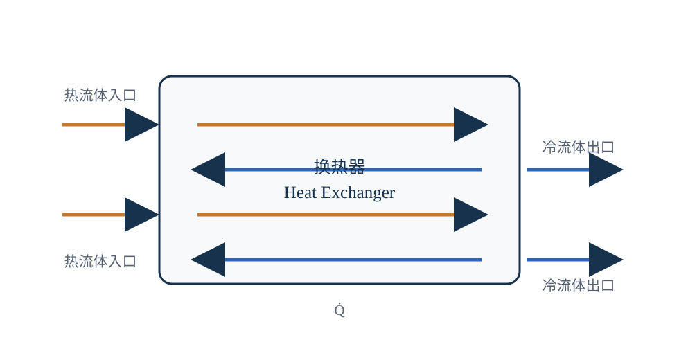

# 换热器

## 一句话理解

换热器（Heat Exchanger，HX）在不同介质之间传递热量，同时受到传热能力、流动阻力、材料、可靠性、可维护性和成本的共同约束。

*图 1：换热器控制体示意。本图为自主绘制的通用工程图，不代表特定产品结构。*

## 常见形式与工程位置

制冷与热泵设备中常见翅片式、壳管式、板式、满液式和降膜式换热器。形式选择取决于：

- 介质组合和是否发生相变；
- 设计压力、温度和制冷剂兼容性；
- 传热面积、空间和制造工艺；
- 允许压降与风机/水泵功率；
- 清洗、防冻、防腐蚀和检修条件。

同一换热器在不同运行模式下可能承担不同功能。热泵制热时，室外侧换热器可能承担蒸发吸热；制冷时，相关换热器可能承担冷凝排热。

## 基本方程

### 单相流体侧能量方程

对于比热容变化可以忽略的单相流体：

$$
\dot{Q}
=
\dot{m}c_p\left(T_{\mathrm{out}}-T_{\mathrm{in}}\right)
$$

### 制冷剂侧焓差方程

当制冷剂经历相变或明显过热、过冷过程时，优先使用比焓差：

$$
\dot{Q}
=
\dot{m}_{r}
\left(h_{\mathrm{out}}-h_{\mathrm{in}}\right)
$$

### 传热方程

采用对数平均温差（Logarithmic Mean Temperature Difference，LMTD）方法时：

$$
\dot{Q}
=
UA\Delta T_{\mathrm{lm}}
$$

其中：

$$
\Delta T_{\mathrm{lm}}
=
\frac{\Delta T_1-\Delta T_2}
{\ln\left(\Delta T_1/\Delta T_2\right)}
$$

$\Delta T_1$ 和 $\Delta T_2$ 分别为换热器两端的温差，具体取值应根据并流、逆流或交叉流布置确定。

| 符号 | 含义 | 常用单位 |
| --- | --- | --- |
| $\dot{Q}$ | 换热量 | kW |
| $\dot{m}$ | 流体质量流量 | kg/s |
| $\dot{m}_{r}$ | 制冷剂质量流量 | kg/s |
| $c_p$ | 定压比热容 | kJ/(kg·K) |
| $T_{\mathrm{in}}$ | 入口温度 | °C 或 K |
| $T_{\mathrm{out}}$ | 出口温度 | °C 或 K |
| $h_{\mathrm{in}}$ | 入口比焓 | kJ/kg |
| $h_{\mathrm{out}}$ | 出口比焓 | kJ/kg |
| $U$ | 总传热系数 | kW/(m²·K) |
| $A$ | 有效传热面积 | m² |
| $\Delta T_{\mathrm{lm}}$ | 对数平均温差 | K |
| $\Delta T_1,\Delta T_2$ | 两端局部温差 | K |

### 计算示例一：水侧换热量

假设水侧质量流量为 $\dot{m}=2.4\ \mathrm{kg/s}$，定压比热容为 $c_p=4.18\ \mathrm{kJ/(kg\cdot K)}$，水温从 $12^\circ\mathrm{C}$ 降至 $7^\circ\mathrm{C}$。

取换热量的绝对值：

$$
\left|\dot{Q}\right|
=
2.4\times4.18\times|7-12|
=
50.16\ \mathrm{kW}
$$

这里的温差使用摄氏温度差即可，因为 $\Delta T$ 的数值与开尔文温差相同。

### 计算示例二：由LMTD估算传热能力

假设：

- $\Delta T_1=8\ \mathrm{K}$；
- $\Delta T_2=4\ \mathrm{K}$；
- $U=1.50\ \mathrm{kW/(m^2\cdot K)}$；
- $A=10\ \mathrm{m^2}$。

则：

$$
\Delta T_{\mathrm{lm}}
=
\frac{8-4}{\ln(8/4)}
=
5.77\ \mathrm{K}
$$

$$
\dot{Q}
=
1.50\times10\times5.77
=
86.55\ \mathrm{kW}
$$

该结果是基于平均参数的初步估算，不能替代分区模型、实际测试或制造商性能数据。

## 蒸发式冷凝器的附加问题

蒸发式冷凝器同时涉及空气显热、水膜蒸发潜热和制冷剂冷凝放热，需要评价：

- 水膜覆盖率和局部干区；
- 风量、喷淋水量和水滴夹带；
- 水侧压降与水泵功率；
- 结垢、腐蚀、补水与排污；
- 清洗、检修和长期性能衰减。

优化目标应优先采用“单位系统总功耗下的有效换热能力”，而不是单独追求最大的传热系数或换热面积。

本文为通用技术整理，不涉及企业内部尺寸、性能曲线、控制阈值或未公开测试数据。
