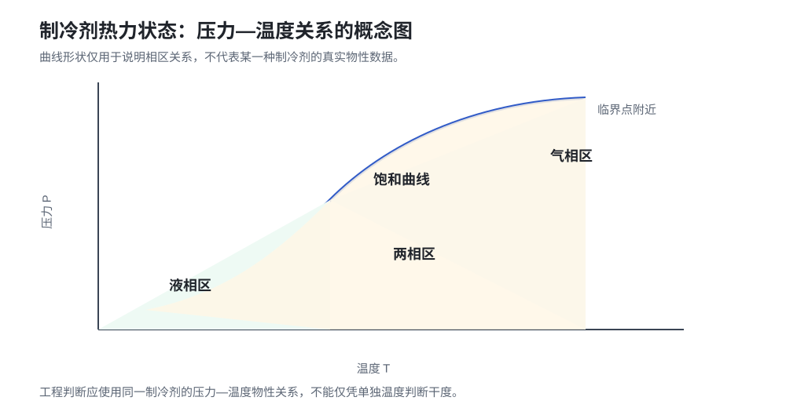

# 02 制冷剂的热力状态

## 状态量与物性

制冷剂（Refrigerant）的状态需要由压力、温度、比焓等状态量共同描述。暖通空调（Heating, Ventilation and Air Conditioning，HVAC）系统中的测量判断，必须使用与实际制冷剂一致的物性关系。

*图 1：制冷剂压力—温度与相区概念图。曲线仅说明相区关系，不代表某一种制冷剂的真实物性数据。*

| 状态量 | English Full Name | 符号 | 主要含义 |
| --- | --- | --- | --- |
| 压力 | Pressure | $P$ | 反映工质受力状态，并影响饱和温度 |
| 温度 | Temperature | $T$ | 反映热状态，但不能单独确定两相比例 |
| 比焓 | Specific Enthalpy | $h$ | 便于分析流动工质的能量变化 |
| 比熵 | Specific Entropy | $s$ | 描述能量传递方向和不可逆程度 |
| 比容 | Specific Volume | $v$ | 单位质量工质所占体积 |
| 干度 | Vapor Quality | $x$ | 两相混合物中的蒸气质量分数 |

## 饱和状态

在给定压力下，液体开始汽化或蒸气开始凝结时对应饱和状态。饱和液线和饱和蒸气线之间是两相区，单独知道温度通常不能确定其中的液气比例。

两相区常用干度表示：

$$
x
=
\frac{m_g}{m_f+m_g}
$$

其中：

| 符号 | 含义 | 常用单位 |
| --- | --- | --- |
| $x$ | 干度，即蒸气质量分数 | 无量纲 |
| $m_g$ | 蒸气质量 | kg |
| $m_f$ | 液体质量 | kg |
| $m_f+m_g$ | 两相混合物总质量 | kg |

若 $m_g=0.20\ \mathrm{kg}$、$m_f=0.80\ \mathrm{kg}$，则：

$$
x
=
\frac{0.20}{0.80+0.20}
=
0.20
$$

在物性表给出 $h_f$ 和 $h_{fg}$ 时，两相混合物比焓为：

$$
h
=
h_f+xh_{fg}
$$

例如 $h_f=200\ \mathrm{kJ/kg}$、$h_{fg}=1800\ \mathrm{kJ/kg}$、$x=0.20$，则：

$$
h
=
200+0.20\times1800
=
560\ \mathrm{kJ/kg}
$$

## 过热蒸气与过冷液体

实际蒸气温度高于同压力饱和温度时为过热蒸气；实际液体温度低于同压力饱和温度时为过冷液体。两者都需要结合压力确定，不能只看温度绝对值。

过热度（Superheat，SH）和过冷度（Subcooling，SC）分别为：

$$
\mathrm{SH}
=
T_{\mathrm{vap}}
-
T_{\mathrm{sat}}\left(P_{\mathrm{vap}}\right)
$$

$$
\mathrm{SC}
=
T_{\mathrm{sat}}\left(P_{\mathrm{liq}}\right)
-
T_{\mathrm{liq}}
$$

| 符号 | 含义 |
| --- | --- |
| $T_{\mathrm{vap}}$ | 实际蒸气温度 |
| $T_{\mathrm{liq}}$ | 实际液体温度 |
| $P_{\mathrm{vap}}$ | 蒸气所在位置压力 |
| $P_{\mathrm{liq}}$ | 液体所在位置压力 |
| $T_{\mathrm{sat}}(P)$ | 给定压力下的饱和温度 |

例如蒸气压力对应饱和温度为 $-2^\circ\mathrm{C}$，实际蒸气温度为 $6^\circ\mathrm{C}$，则 $\mathrm{SH}=8\ \mathrm{K}$。若液体压力对应饱和温度为 $35^\circ\mathrm{C}$，实际液体温度为 $30^\circ\mathrm{C}$，则 $\mathrm{SC}=5\ \mathrm{K}$。

## 工程意义

测量压力后，通过同一制冷剂的物性表或可靠物性库得到对应饱和温度，再与现场温度比较，才能计算过热度和过冷度。不同制冷剂的压力—温度关系不同，不能混用经验表。
