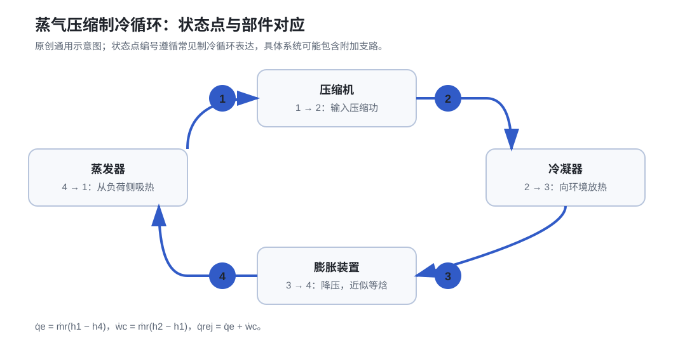

# 03 蒸气压缩制冷循环

*图 1：蒸气压缩制冷循环四状态点示意。本图为自主绘制的通用原理图。*

## 先用一段话理解循环

蒸气压缩制冷循环（Vapor-Compression Refrigeration Cycle，VCRC）以制冷剂为工作介质。它借助压缩机输入的功，把热量从温度较低的空气、水或被冷却对象中转移出来，最后排到温度较高的室外空气、冷却水或蒸发冷却介质中。人们感觉到的“制冷”，实质上是被冷却侧的热量被持续搬走。

循环能够工作，关键在于制冷剂的饱和温度会随压力变化而变化。压缩机建立高、低压侧：低压侧对应较低的饱和温度，制冷剂便能在蒸发器内以较低温度沸腾吸热；高压侧对应较高的饱和温度，制冷剂便能在冷凝器内以较高温度向环境放热并冷凝。可把这一关系写为：

$$
T_{\mathrm{sat}} = T_{\mathrm{sat}}(p)
$$

其中，$T_{\mathrm{sat}}$ 为制冷剂在压力 $p$ 下的饱和温度；$p$ 为制冷剂压力。该式表达的是压力与饱和温度的一一对应关系，并不表示蒸发温度或冷凝温度等于冷冻水、冷却水或空气温度。

一个完整循环可按下面的顺序理解：

1. 压缩机吸入低温、低压的过热制冷剂蒸气，并通过做功使其成为高温、高压的过热蒸气；
2. 制冷剂进入冷凝器，先去过热，再在近似恒压下冷凝放热，并可能继续降温形成一定过冷度；
3. 高压液体流经膨胀装置，经历近似等焓降压，部分液体立即闪发为蒸气，形成低温、低压的气液两相混合物；
4. 两相制冷剂进入蒸发器，从空气或水等被冷却介质吸热并逐步汽化，末端形成具有适当过热度的低压蒸气，重新回到压缩机。

这四步始终围绕两类温差展开：蒸发器内制冷剂温度必须低于被冷却介质温度，冷凝器内制冷剂温度必须高于环境或冷却介质温度。温差提供传热驱动力；压缩机提供把热量“抬升”到较高温度水平所需的功。

## 四个核心过程

| 过程 | 主要部件 | 状态变化 | 学习时应抓住的重点 |
| --- | --- | --- | --- |
| $1\rightarrow2$ 压缩 | 压缩机（Compressor） | 低压蒸气变为高压蒸气，温度和比焓上升 | 压缩机输入功，建立高压侧 |
| $2\rightarrow3$ 冷凝 | 冷凝器（Condenser） | 高压蒸气去过热、放热冷凝并可能过冷 | 制冷剂温度高于冷却介质温度才能排热 |
| $3\rightarrow4$ 节流 | 膨胀装置（Expansion Device） | 压力骤降，部分液体闪发为蒸气 | 节流近似等焓，温度下降不等于“没有能量变化” |
| $4\rightarrow1$ 蒸发 | 蒸发器（Evaporator） | 低压两相制冷剂吸热汽化并形成过热蒸气 | 制冷量在这里产生，被冷却对象的热量在这里被带走 |

真实系统还可能包含气液分离器、经济器、回热器、旁通管路和热回收支路。无论系统如何扩展，四个基本过程和能量守恒始终是分析的起点。

## 四个状态点与换热条件

通常将压缩机入口、压缩机出口、冷凝器出口和膨胀装置出口分别记为状态点 $1$、$2$、$3$、$4$。

| 状态点 | 典型位置 | 典型相态 | 关键理解 |
| --- | --- | --- | --- |
| 1 | 压缩机入口或蒸发器出口附近 | 低压过热蒸气 | 应避免液体进入压缩机 |
| 2 | 压缩机出口 | 高压过热蒸气 | 排气温度和压力反映压缩负担 |
| 3 | 冷凝器出口或液管 | 高压液体，常带一定过冷度 | 应尽量保证膨胀装置前为稳定液体 |
| 4 | 膨胀装置出口 | 低压气液两相混合物 | 闪发蒸气存在，但不会直接贡献蒸发器有效制冷量 |

冷凝器中，制冷剂的冷凝温度 $T_c$ 通常高于冷却介质温度 $T_{\mathrm{sink}}$，因此热量能够向外传递。蒸发器中，制冷剂的蒸发温度 $T_e$ 通常低于被冷却介质温度 $T_{\mathrm{load}}$，因此热量能够从负荷侧传入制冷剂。可用简化关系表示为：

$$
T_c > T_{\mathrm{sink}},
\qquad
T_e < T_{\mathrm{load}}
$$

其中，$T_c$ 为冷凝温度，$T_e$ 为蒸发温度，$T_{\mathrm{sink}}$ 为冷凝器侧环境、冷却水或蒸发冷却介质温度，$T_{\mathrm{load}}$ 为蒸发器侧空气、冷冻水或其他被冷却介质温度。实际工程中还应考虑换热器趋近温差、流量、污垢和压力损失。

## 基本方程：给循环记一笔能量账

膨胀装置内通常没有轴功输入，且与环境换热很小，因此节流过程常采用等焓近似：

$$
h_3 \simeq h_4
$$

单位质量制冷剂在四个主要过程中的能量变化可写为：

$$
\begin{aligned}
q_e &= h_1-h_4, \\
w_{\mathrm{comp}} &= h_2-h_1, \\
q_c &= h_2-h_3 \simeq q_e+w_{\mathrm{comp}}.
\end{aligned}
$$

制冷性能系数（Coefficient of Performance for Refrigeration，$\mathrm{COP}_{\mathrm{R}}$）为：

$$
\mathrm{COP}_{\mathrm{R}}
=
\frac{q_e}{w_{\mathrm{comp}}}
=
\frac{h_1-h_4}{h_2-h_1}
$$

若制冷剂质量流量为 $\dot{m}_r$，则可写成功率形式：

$$
\begin{aligned}
\dot{Q}_e &= \dot{m}_r\left(h_1-h_4\right), \\
P_{\mathrm{comp}} &= \dot{m}_r\left(h_2-h_1\right), \\
\dot{Q}_c &= \dot{m}_r\left(h_2-h_3\right).
\end{aligned}
$$

| 符号 | 含义 | 常用单位 |
| --- | --- | --- |
| $h_1,h_2,h_3,h_4$ | 四个状态点的制冷剂比焓 | kJ/kg |
| $q_e$ | 单位质量制冷效应，即蒸发器从负荷侧吸收的热量 | kJ/kg |
| $w_{\mathrm{comp}}$ | 单位质量压缩功 | kJ/kg |
| $q_c$ | 单位质量冷凝放热量 | kJ/kg |
| $\dot{m}_r$ | 制冷剂质量流量 | kg/s |
| $\dot{Q}_e$ | 蒸发器制冷量 | kW |
| $P_{\mathrm{comp}}$ | 按循环焓差计算的压缩功率 | kW |
| $\dot{Q}_c$ | 冷凝器放热量 | kW |

这里的 $P_{\mathrm{comp}}$ 用于说明循环内部能量关系。现场电表读到的压缩机输入功率还会受到等熵效率、电机效率、变频器和控制策略影响，因此实际值通常需要结合设备样本或测量数据判断。

### 计算示例

假设某一简化循环的状态点比焓为：

- $h_1=410~\mathrm{kJ/kg}$；
- $h_2=450~\mathrm{kJ/kg}$；
- $h_3=250~\mathrm{kJ/kg}$；
- $h_4\simeq250~\mathrm{kJ/kg}$；
- $\dot{m}_r=0.50~\mathrm{kg/s}$。

则单位质量制冷效应为：

$$
q_e
=
410-250
=
160~\mathrm{kJ/kg}
$$

单位质量压缩功为：

$$
w_{\mathrm{comp}}
=
450-410
=
40~\mathrm{kJ/kg}
$$

单位质量冷凝放热量为：

$$
q_c
=
450-250
=
200~\mathrm{kJ/kg}
$$

可见：

$$
q_c
=
q_e+w_{\mathrm{comp}}
=
160+40
=
200~\mathrm{kJ/kg}
$$

制冷性能系数为：

$$
\mathrm{COP}_{\mathrm{R}}
=
\frac{160}{40}
=
4.0
$$

制冷量和循环压缩功率分别为：

$$
\dot{Q}_e
=
0.50\times160
=
80~\mathrm{kW}
$$

$$
P_{\mathrm{comp}}
=
0.50\times40
=
20~\mathrm{kW}
$$

这里的 $\mathrm{kJ/kg}$ 与 $\mathrm{kg/s}$ 相乘得到 $\mathrm{kJ/s}$，数值上等于 kW。该例用于理解能量账本；实际机组还要计入压缩效率、风机、水泵和控制设备的功耗。

## 理想与真实：从公式走向设备

真实压缩过程存在效率损失，换热器有有限温差和压降，管路可能吸热或散热，膨胀阀还受到负荷波动和控制响应影响。因此，状态点不能只凭理想图线推断。

学习时应把“状态点—部件—测量点—能量变化”对应起来：

- 看到高压或高冷凝温度时，优先回到冷凝器的排热条件；
- 看到低压或低蒸发温度时，优先回到蒸发器的吸热条件、供液与负荷；
- 看到过热度或过冷度异常时，结合膨胀装置、制冷剂库存和流量共同判断；
- 比较能效时，先明确边界：是循环 COP、机组 COP，还是包含水泵和风机的系统 COP。

完成本节后，可阅读 [蒸发与冷凝温度](./04-evap-condensation-temperature)、[过热与过冷](./06-superheat-subcooling) 和 [本章总结与学习检查](./12-summary-check)。
