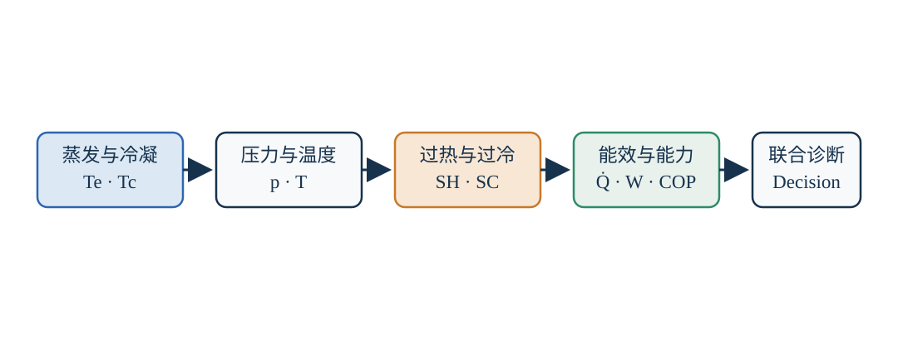

# 13 工程答疑区 · Field FAQ

本节把员工常见问题统一到一条分析主线：**蒸发温度决定低压侧吸热条件，冷凝温度决定高压侧排热条件；充注量与膨胀阀影响制冷剂分配；过热度与过冷度是判断循环状态的重要指标。**

对于蒸气压缩式制冷系统（Vapor-Compression Refrigeration System，VCRS），现场判断不能只看一个压力或温度，应同时观察蒸发压力、冷凝压力、吸气温度、排气温度、过热度、过冷度、负荷、流量和换热条件。

图 13-1　制冷系统状态参数与工程诊断链。图为本知识库自主绘制。

## 先给结论

| 参数或状态 | 偏高时的常见趋势 | 偏低时的常见趋势 |
| --- | --- | --- |
| 蒸发温度 $T_e$ | 压缩比通常降低，效率可能提高，但供冷温度能力减弱 | 压缩比通常增大，制冷量和效率可能下降，排气温度可能升高 |
| 冷凝温度 $T_c$ | 压缩比和压缩功增加，制冷性能系数（Coefficient of Performance，COP）下降 | 通常有利于效率，但过低可能影响压差和供液稳定 |
| 吸气过热度 $SH_s$ | 蒸发器缺液、吸气温度和排气温度升高的可能性增加 | 回液、湿压缩甚至液击风险增加 |
| 过冷度 $SC$ | 在合理范围内减少闪发并提高单位质量制冷效应；过大可能提示液体积存或充注偏多 | 膨胀阀前可能出现闪发气体，供液质量下降 |
| 膨胀阀开度 | 开度过大可能低过热或回液 | 开度过小可能高过热、蒸发器缺液 |
| 制冷剂充注量 | 过多会抬高高压侧液体库存和冷凝压力 | 常见低过冷、高过热、制冷量下降，但需排除其他原因 |

> **诊断原则：**“低压低、过热高”只能说明低压侧供液或换热可能不足，不能单独证明制冷剂不足。风量/水量不足、过滤器堵塞、阀开度过小、液管压降过大等原因也可能产生相似现象。

## 1. 蒸发温度是什么？对制冷循环有什么影响？

### 结论

**蒸发温度（Evaporating Temperature，$T_e$）**是制冷剂在蒸发器两相区内、由蒸发压力确定的饱和温度。它表示制冷剂以什么温度水平从被冷却介质吸热，不等于冷冻水出水温度、送风温度或蒸发器出口管壁温度。

对于纯制冷剂或近共沸制冷剂：

$$
T_e=T_{mathrm{sat}}(p_e)
$$

其中：

| 符号 | 含义 | 常用单位 |
| --- | --- | --- |
| $T_e$ | 蒸发温度 | $^circmathrm{C}$ 或 $mathrm{K}$ |
| $p_e$ | 蒸发压力 | $mathrm{kPa}$、$mathrm{MPa}$ 或 bar |
| $T_{mathrm{sat}}$ | 给定压力下的饱和温度函数 | 与温度相同 |

对于 R407C 等具有温度滑移的非共沸混合制冷剂，必须根据测点状态区分露点温度（Dew-point Temperature）和泡点温度（Bubble-point Temperature）。计算蒸气过热度时通常使用露点温度。

蒸发温度提高时，蒸发压力通常提高，压缩机压比降低，系统效率往往改善；但蒸发温度不能无限提高，因为制冷剂必须低于被冷却介质，才能维持换热驱动力。

### 计算示例

冷冻水从 $12~^circmathrm{C}$ 降至 $7~^circmathrm{C}$，制冷剂蒸发温度为 $2~^circmathrm{C}$。用冷冻水出水侧定义简化蒸发侧趋近温差（Evaporating Approach Temperature Difference）：

$$
Delta T_{mathrm{app,e}}
=
T_{mathrm{chw,out}}-T_e
=
7-2
=
5~mathrm{K}
$$

| 符号 | 含义 |
| --- | --- |
| $Delta T_{mathrm{app,e}}$ | 蒸发侧趋近温差 |
| $T_{mathrm{chw,out}}$ | 冷冻水出水温度 |
| $T_e$ | 制冷剂蒸发温度 |

这个温差越大，通常说明换热器传热温差、污垢、流量或换热面积仍有优化空间，但不能仅凭该值判定故障。

理想逆卡诺制冷循环（Reversed Carnot Refrigeration Cycle）的理论性能系数为：

$$
mathrm{COP}_{mathrm{R,Carnot}}
=
rac{T_e}{T_c-T_e}
$$

该式中的 $T_e$ 和 $T_c$ 必须使用绝对温度 K。若 $T_e=5~^circmathrm{C}=278.15~mathrm{K}$，$T_c=45~^circmathrm{C}=318.15~mathrm{K}$：

$$
mathrm{COP}_{mathrm{R,Carnot}}
=
rac{278.15}{318.15-278.15}
approx 6.95
$$

当 $T_e$ 降至 $0~^circmathrm{C}=273.15~mathrm{K}$，且 $T_c$ 不变：

$$
mathrm{COP}_{mathrm{R,Carnot}}
=
rac{273.15}{318.15-273.15}
approx 6.07
$$

这只是理论上限，但清楚说明了：在其他条件相同时，蒸发温度越低，完成同样制冷任务通常越费力。实际系统还会受到压缩机效率、换热器传热、节流损失和辅助功耗影响。

## 2. 冷凝温度是什么？对制冷循环有什么影响？

### 结论

**冷凝温度（Condensing Temperature，$T_c$）**是高压侧制冷剂在冷凝过程中对应冷凝压力的饱和温度，表示制冷剂以什么温度水平向空气、冷却水或其他热汇排热：

$$
T_c=T_{mathrm{sat}}(p_c)
$$

| 符号 | 含义 | 常用单位 |
| --- | --- | --- |
| $T_c$ | 冷凝温度 | $^circmathrm{C}$ 或 $mathrm{K}$ |
| $p_c$ | 冷凝压力 | $mathrm{kPa}$、$mathrm{MPa}$ 或 bar |
| $T_{mathrm{sat}}$ | 给定压力下的饱和温度函数 | 与温度相同 |

必须区分：

$$
oxed{
T_c
eq T_{mathrm{cooling water}}

eq T_{mathrm{liquid,out}}
}
$$

例如冷却水由 $30~^circmathrm{C}$ 升至 $35~^circmathrm{C}$，制冷剂冷凝温度可能约为 $40~^circmathrm{C}$，因为热量传递必须存在温差。

### 影响链与示例

冷凝温度升高通常形成如下因果链：

**冷凝温度升高 → 冷凝压力升高 → 压缩比增大 → 压缩机单位质量耗功增加 → 排气温度可能升高 → COP 降低。**

若蒸发温度保持 $5~^circmathrm{C}=278.15~mathrm{K}$，冷凝温度升至 $50~^circmathrm{C}=323.15~mathrm{K}$：

$$
mathrm{COP}_{mathrm{R,Carnot}}
=
rac{278.15}{323.15-278.15}
approx 6.18
$$

因此，降低不必要的冷凝温度通常具有节能意义；但不能无限追求低冷凝温度，还要满足膨胀装置的必要压差、稳定供液和压缩机运行边界。

## 3. 制冷剂不足会造成什么影响？

### 结论

制冷剂不足的本质是：系统内制冷剂库存不足，难以同时建立设计所需的冷凝液体储备和蒸发器供液状态。典型因果链是：

**制冷剂不足 → 高压侧液体储量不足 → 过冷度减小 → 膨胀阀供液不足 → 蒸发器缺液 → 过热度升高 → 制冷量下降。**

蒸发器制冷量可用能量守恒表示：

$$
dot{Q}_e
=
dot{m}_rleft(h_1-h_4
ight)
$$

| 符号 | 含义 | 常用单位 |
| --- | --- | --- |
| $dot{Q}_e$ | 蒸发器制冷量 | kW |
| $dot{m}_r$ | 制冷剂质量流量 | kg/s |
| $h_1$ | 蒸发器出口或压缩机入口附近制冷剂比焓 | kJ/kg |
| $h_4$ | 节流后、蒸发器入口制冷剂比焓 | kJ/kg |
| $h_1-h_4$ | 单位质量制冷效应 | kJ/kg |

### 计算示例

若 $dot{m}_r=0.10~mathrm{kg/s}$，$h_1-h_4=150~mathrm{kJ/kg}$：

$$
dot{Q}_e
=
0.10	imes150
=
15~mathrm{kW}
$$

若有效质量流量下降至 $0.08~mathrm{kg/s}$，其他条件暂按不变：

$$
dot{Q}_e
=
0.08	imes150
=
12~mathrm{kW}
$$

制冷量下降：

$$
rac{15-12}{15}	imes100%
=
20%
$$

真实系统中，充注量变化还会改变压力、焓值和阀控状态，因此该示例用于说明质量流量影响，不是现场定量预测。

### 现场表现与排除顺序

常见表现包括低压偏低、吸气过热度偏高、液管过冷度偏小、制冷能力不足、吸气冷却减弱以及排气温度升高。

推荐按以下顺序核查：泄漏与充注记录 → 高低压与对应饱和温度 → 过热度和过冷度 → 风量/水量 → 过滤器和液管压降 → 膨胀阀及传感器。未经确认，不应仅凭低压进行补充充注。

## 4. 膨胀阀开度过大或过小会怎样？

### 结论

膨胀装置（Expansion Device）的两个基本作用是节流降压和调节进入蒸发器的制冷剂质量流量。常见的热力膨胀阀（Thermostatic Expansion Valve，TXV）和电子膨胀阀（Electronic Expansion Valve，EEV）通常围绕蒸发器出口过热度进行控制。

**开度过大：**

供液量超过当前负荷和换热能力时，蒸发器出口可能仍接近两相状态，出现低过热、吸气管结露或结霜、回气带液、湿压缩甚至液击风险；吸气压力也可能偏高。

**开度过小：**

供液不足时，制冷剂在蒸发器前段过早汽化，后部形成较长过热区，表现为高过热、吸气压力可能偏低、换热面积利用不足、制冷量下降，严重时排气温度升高。

因此，控制目标不是固定“阀开度”，而是在当前负荷、压力和换热条件下维持合理且稳定的蒸发器出口过热度。判断阀门问题前，还要检查传感器位置、压力测量、过滤器、液管压降和系统负荷。

## 5. 什么是回气过热度和排气过热度？

### 回气过热度

过热蒸气（Superheated Vapor）是已完成汽化的制冷剂继续吸热后，温度高于同一压力下饱和蒸气温度的状态。

工程上常说的回气或吸气过热度（Suction Superheat，$SH_s$）可定义为：

$$
SH_s
=
T_s-T_{mathrm{sat,dew}}(p_s)
$$

| 符号 | 含义 |
| --- | --- |
| $SH_s$ | 压缩机吸气过热度 |
| $T_s$ | 压缩机吸气口实际制冷剂温度 |
| $p_s$ | 压缩机吸气压力 |
| $T_{mathrm{sat,dew}}(p_s)$ | $p_s$ 对应的露点饱和温度 |

例如吸气压力对应的露点温度为 $3~^circmathrm{C}$，实际吸气温度为 $9~^circmathrm{C}$：

$$
SH_s=9-3=6~mathrm{K}
$$

应区分蒸发器出口过热度和压缩机吸气总过热度。二者的差值通常来自吸气管路吸热和压力损失。

### 排气过热度

排气过热度（Discharge Superheat，$SH_d$）可用于描述压缩机排气温度相对于排气压力对应饱和蒸气温度的偏离：

$$
SH_d
=
T_d-T_{mathrm{sat,dew}}(p_d)
$$

| 符号 | 含义 |
| --- | --- |
| $SH_d$ | 排气过热度 |
| $T_d$ | 压缩机排气实际温度 |
| $p_d$ | 压缩机排气压力 |
| $T_{mathrm{sat,dew}}(p_d)$ | $p_d$ 对应的露点饱和温度 |

例如 $T_d=80~^circmathrm{C}$，排气压力对应露点温度为 $45~^circmathrm{C}$：

$$
SH_d=80-45=35~mathrm{K}
$$

在压缩机保护中，排气温度本身通常是更直接的保护量。跨临界工况下高压侧没有通常意义上的饱和温度，不能机械套用该过热度定义。

## 6. 空调标准制冷工况的温度参数大概是多少？

### 先区分“评价工况”和“现场运行工况”

“标准制冷工况”不是所有设备共用的一组数值。压缩机性能评价、冷水机组额定性能和现场调试的边界条件不同，最终应以适用标准和厂家额定条件为准。

下面给出便于学习的典型示例，不应当当作所有项目的统一运行目标。

| 参考对象 | 参数 | 典型示例 |
| --- | --- | --- |
| 容积式压缩机性能评价 | 蒸发温度 | $7.2~^circmathrm{C}$ |
|  | 压缩机吸气温度 | $18.3~^circmathrm{C}$ |
|  | 冷凝温度 | $54.4~^circmathrm{C}$ |
|  | 液体温度 | $46.1~^circmathrm{C}$ |
|  | 环境温度 | $35~^circmathrm{C}$ |
| 冷水系统常见设计 | 冷冻水供回水 | $7/12~^circmathrm{C}$ |
| 风冷机组常见额定边界 | 室外干球温度 | 约 $35~^circmathrm{C}$ |
| 水冷机组常见参考边界 | 冷却水进出水 | 约 $30/35~^circmathrm{C}$ |

上述压缩机示例的过热度和过冷度为：

$$
SH=18.3-7.2=11.1~mathrm{K}
$$

$$
SC=54.4-46.1=8.3~mathrm{K}
$$

| 符号 | 含义 |
| --- | --- |
| $SH$ | 以该评价点计算的过热度 |
| $SC$ | 以该评价点计算的过冷度 |

要特别避免：冷冻水 $7~^circmathrm{C}$ 不等于蒸发温度 $7~^circmathrm{C}$；室外空气 $35~^circmathrm{C}$ 也不等于冷凝温度 $35~^circmathrm{C}$。真实温差由换热器性能、流量、污垢和控制策略共同决定。

## 7. 过冷度对制冷循环有什么影响？

### 结论

过冷度（Subcooling，$SC$）是冷凝完成后的液态制冷剂继续降至饱和液体温度以下的程度。对纯制冷剂及非共沸混合制冷剂，液体侧计算通常采用泡点温度：

$$
SC
=
T_{mathrm{sat,bubble}}(p_l)-T_l
$$

| 符号 | 含义 |
| --- | --- |
| $SC$ | 过冷度 |
| $p_l$ | 液管测点压力 |
| $T_{mathrm{sat,bubble}}(p_l)$ | $p_l$ 对应泡点饱和温度 |
| $T_l$ | 液管实际温度 |

若泡点温度为 $42~^circmathrm{C}$，液管温度为 $36~^circmathrm{C}$：

$$
SC=42-36=6~mathrm{K}
$$

合理过冷主要有三项作用：保证膨胀阀入口尽可能为液体；减少液管压降或吸热造成的闪发气体；降低节流前比焓并提高单位质量制冷效应。

节流过程常采用等焓近似：

$$
h_4approx h_3
$$

蒸发器单位质量制冷量为：

$$
q_e=h_1-h_4
$$

| 符号 | 含义 | 常用单位 |
| --- | --- | --- |
| $h_1$ | 蒸发器出口比焓 | kJ/kg |
| $h_3$ | 冷凝器出口比焓 | kJ/kg |
| $h_4$ | 节流后比焓 | kJ/kg |
| $q_e$ | 单位质量制冷效应 | kJ/kg |

若 $h_1=410~mathrm{kJ/kg}$、$h_4=250~mathrm{kJ/kg}$：

$$
q_e=410-250=160~mathrm{kJ/kg}
$$

额外过冷后，假设 $h_4$ 降至 $240~mathrm{kJ/kg}$：

$$
q_e=410-240=170~mathrm{kJ/kg}
$$

单位质量制冷效应的理论增加率为：

$$
rac{170-160}{160}	imes100%
=
6.25%
$$

该计算是热力学示例，真实值取决于制冷剂、压力、换热器和管路条件。过冷度也不是越大越好；过高可能意味着冷凝器内液体积存、充注偏多或冷凝压力偏高。

## 8. 过热度对制冷循环有什么影响？

### 结论

过热度（Superheat，$SH$）是压缩机安全与蒸发器利用率之间的平衡指标。其一般表达式为：

$$
SH
=
T_{mathrm{vapor}}-T_{mathrm{sat,dew}}(p)
$$

| 符号 | 含义 |
| --- | --- |
| $SH$ | 过热度 |
| $T_{mathrm{vapor}}$ | 测点处制冷剂实际蒸气温度 |
| $p$ | 测点处制冷剂压力 |
| $T_{mathrm{sat,dew}}(p)$ | 同一压力对应的露点饱和温度 |

**过热度过低：**蒸发器出口可能仍接近两相状态，甚至夹带液滴，可能出现回液、湿压缩、润滑油稀释和液击风险。

**过热度过高：**蒸发器可能缺液，后部过热区变长，有效两相换热面积下降；吸气温度升高、吸气密度降低、质量流量可能下降，最终使制冷量和效率恶化，排气温度可能升高。

还应区分蒸发器内的有效过热和吸气管路额外吸热形成的过热。前者仍可能从被冷却对象吸热，后者通常不增加有效制冷量，却会提高压缩机吸气温度。

## 末尾答疑：如何把参数异常转化为检查动作？

| 观察到的状态 | 优先理解 | 首先检查 |
| --- | --- | --- |
| 蒸发温度偏低 | 低压侧换热或供液不足，也可能负荷过低 | 负荷、流量、蒸发器污垢、阀开度、吸气压力 |
| 冷凝温度偏高 | 高压侧排热受阻或压缩功增加 | 室外空气/冷却水条件、风量/水量、冷凝器污垢、不凝性气体 |
| 高过热度 | 蒸发器缺液、吸气管路吸热过大或测量异常 | 过冷度、阀前液态、传感器、过滤器、液管压降 |
| 低过热度 | 供液过多或负荷快速变化，存在回液风险 | 阀控制、负荷、蒸发器出口状态、压缩机保护 |
| 低过冷度 | 液体储备不足或冷凝器出口不稳定 | 充注量、泄漏、冷凝压力、液管闪发 |
| 高过冷度 | 液体积存、充注偏多或液管换热较强 | 冷凝器液位、充注记录、液管温度与压降 |
| 低压低且高过热 | 供液不足或蒸发侧换热不足 | 不要直接补液，先排查上述多种原因 |
| 高压高且高排气温度 | 排热受阻或压缩比过高 | 冷凝侧换热、风水流量、制冷剂状态、压缩机工况 |

## 安全边界

本页用于学习、计算和诊断框架，不替代设备说明书、适用标准或现场安全规程。制冷剂回收、充注、泄漏处理和压力部件操作应由经过培训并具备相应资质的人员完成；不得为了“调出某个过热度或过冷度”而盲目放气或补液。

下一步可继续阅读 [本章总结与学习检查](./12-summary-check)，然后进入 [设备与部件](/components/)。
