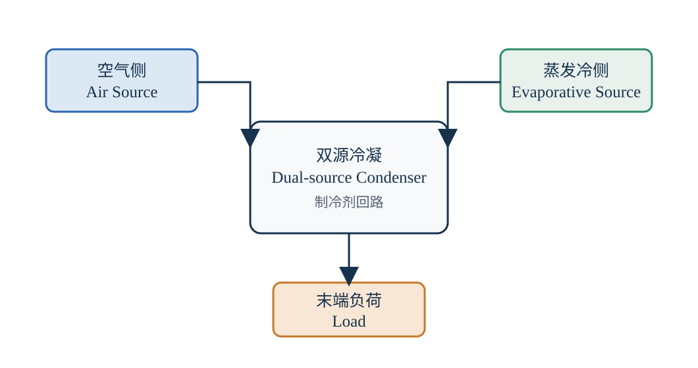

# 双源模块式冷水（热泵）机组

## 页面定位

暖通空调（Heating, Ventilation and Air Conditioning，HVAC）设备需要放在完整的能源系统中评价。双源模块式冷水（热泵）机组可以作为一个公开学习案例，用于理解冷凝排热、制冷制热切换、部分负荷运行和系统能效之间的关系。

本文依据公开热泵原理和工程分析方法自主整理，不对应任何特定企业的完整产品说明书，也不公开企业内部图纸、参数、控制阈值或测试数据。

## 一句话理解

双源模块式冷水（热泵）机组通过协调空气侧换热与水蒸发冷却过程，在不同室外温湿度和负荷条件下调节排热方式，以降低冷凝侧的综合运行代价，并兼顾制冷、制热和模块化部署需求。

*图 1：双源冷凝系统边界与能量路径。本图为基于公开原理的原创示意，不代表任何具体产品结构。*

## “双源”指什么

双源冷凝（Dual-Source Condensing）通常表示排热侧同时利用空气显热交换和水蒸发潜热交换：

- 空气侧通过风量和换热面积带走热量；
- 水蒸发过程利用汽化潜热增强排热能力；
- 控制系统根据环境条件、负荷和设备边界调节风机、循环水泵及压缩机；
- 实际评价还要计入补水、排污、水处理、防垢、防腐蚀和维护工作。

双源并不自动等于更高能效。只有当冷凝温度下降带来的压缩功节省，大于风机、水泵和水处理带来的附加消耗时，系统综合性能才会改善。

## 制冷与制热运行

制冷工况下，蒸发器从冷冻水或空气负荷侧吸热，冷凝器向环境排热。制热工况下，热泵循环通过换向使室外侧换热器从环境吸热，室内侧或水侧换热器向负荷侧放热。

因此，换热器设计需要同时考虑：

- 制冷冷凝能力与制热蒸发吸热能力；
- 室外低温下的结霜与除霜；
- 制冷剂侧和空气/水侧压降；
- 风机、水泵和控制器的功率；
- 水质、腐蚀、结垢与可维护性；
- 多模块启停和部分负荷稳定性。

## 系统边界与标准公式

系统输入功率定义为：

$$
P_{\mathrm{sys}}
=
P_{\mathrm{comp}}
+
P_{\mathrm{fan}}
+
P_{\mathrm{pump}}
+
P_{\mathrm{aux}}
$$

系统制冷性能系数（Coefficient of Performance，COP）定义为：

$$
\mathrm{COP}_{\mathrm{sys}}
=
\frac{\dot{Q}_{\mathrm{cool}}}{P_{\mathrm{sys}}}
$$

冷凝排热量在稳态、忽略储能变化时可近似表示为：

$$
\dot{Q}_{\mathrm{rej}}
=
\dot{Q}_{\mathrm{cool}}
+
P_{\mathrm{comp}}
$$

| 符号 | 含义 | 常用单位 |
| --- | --- | --- |
| $P_{\mathrm{sys}}$ | 系统总输入功率 | kW |
| $P_{\mathrm{comp}}$ | 压缩机输入功率 | kW |
| $P_{\mathrm{fan}}$ | 风机输入功率 | kW |
| $P_{\mathrm{pump}}$ | 循环水泵输入功率 | kW |
| $P_{\mathrm{aux}}$ | 控制器及其他辅助设备功率 | kW |
| $\dot{Q}_{\mathrm{cool}}$ | 有效制冷量 | kW |
| $\dot{Q}_{\mathrm{rej}}$ | 向环境排出的热量 | kW |
| $\mathrm{COP}_{\mathrm{sys}}$ | 系统制冷性能系数 | 无量纲 |

### 计算示例

假设某公开化算例在稳定制冷工况下：

- $\dot{Q}_{\mathrm{cool}}=100\ \mathrm{kW}$；
- $P_{\mathrm{comp}}=28\ \mathrm{kW}$；
- $P_{\mathrm{fan}}=3\ \mathrm{kW}$；
- $P_{\mathrm{pump}}=1.2\ \mathrm{kW}$；
- $P_{\mathrm{aux}}=0.8\ \mathrm{kW}$。

则系统总功率为：

$$
P_{\mathrm{sys}}
=
28+3+1.2+0.8
=
33\ \mathrm{kW}
$$

系统COP为：

$$
\mathrm{COP}_{\mathrm{sys}}
=
\frac{100}{33}
=
3.03
$$

若只用压缩机功率计算，则：

$$
\mathrm{COP}_{\mathrm{comp}}
=
\frac{100}{28}
=
3.57
$$

两者差异说明：设备宣传或实验报告必须明确能效指标的系统边界，不能把压缩机COP直接当作整机COP。相应的冷凝排热量约为：

$$
\dot{Q}_{\mathrm{rej}}
=
100+28
=
128\ \mathrm{kW}
$$

这里的排热量计算只使用压缩机功率，是教学用近似；完整评价还应根据实测电功率、热损失和各侧能量平衡进行校核。

## 可公开研究的优化方向

- 空气流量、循环水量与喷淋密度的协同控制；
- 布水均匀性、局部干区和换热面积利用率；
- 制冷、制热双工况的换热器配置；
- 多模块启停、变频和部分负荷运行；
- 水质、电导率、排污和防垢策略；
- 结霜识别与除霜控制；
- 换热收益、总功耗、用水量和维护成本的多目标优化。

企业资料如果要转化为公共知识，应经过“知识点提取 → 工程机理泛化 → 公开来源核验 → 自主文字和图件重写”流程。只有能够脱离具体企业产品独立成立的通用方法，才适合进入本页面。
