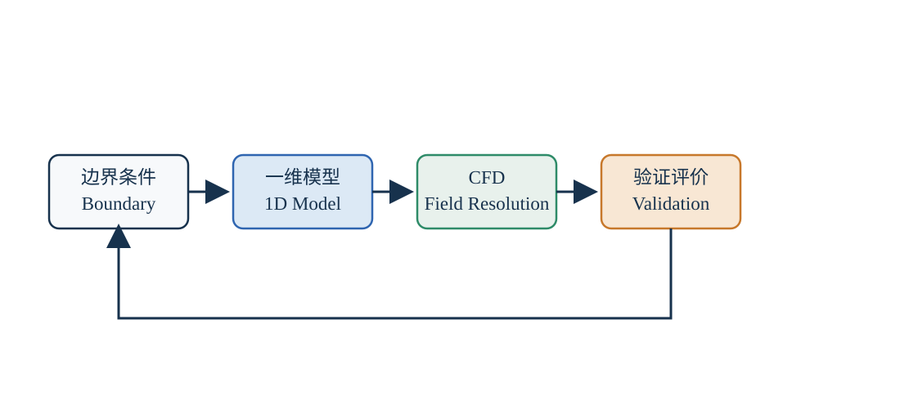

# 换热器建模与优化

## 一句话结论

换热器优化应先用一维模型建立性能基线，再用计算流体力学（Computational Fluid Dynamics，CFD）分析局部流动、布水和温度场，最后将换热量、压降、风机功率、水泵功率和用水量纳入整机评价。

*图 1：换热器建模与优化工作流。本图为自主绘制的通用方法示意。*

## 建模边界与数据

建模前至少需要明确：

- 换热器类型和几何范围；
- 管径、管长、管排数、管间距和材料；
- 制冷剂及其物性来源；
- 制冷剂侧进出口压力、温度、流量或焓值；
- 空气侧温度、湿度、风量和允许压降；
- 喷淋水流量、水温和水质边界；
- 压缩机、风机和水泵功率；
- 制冷和制热工况的边界条件。

缺失参数必须标记为假设值，并在结果表中保留假设来源。模型计算值不能直接写成实测性能。

## 一维模型

可以把换热器划分为多个控制体，分别计算过热段、相变段和过冷段。制冷剂侧换热量为：

$$
\dot{Q}_{r}
=
\dot{m}_{r}
\left(h_{\mathrm{out}}-h_{\mathrm{in}}\right)
$$

空气侧显热为：

$$
\dot{Q}_{a,\mathrm{s}}
=
\dot{m}_{a}c_{p,a}
\left(T_{a,\mathrm{out}}-T_{a,\mathrm{in}}\right)
$$

水蒸发潜热可初步表示为：

$$
\dot{Q}_{w,\mathrm{lat}}
=
\dot{m}_{\mathrm{evap}}h_{\mathrm{fg}}
$$

若以体积流量估算风机或水泵功率，可使用：

$$
P_{\mathrm{fan}}
=
\frac{\Delta p_{\mathrm{fan}}\dot{V}_{a}}{\eta_{\mathrm{fan}}}
$$

$$
P_{\mathrm{pump}}
=
\frac{\Delta p_{\mathrm{pump}}\dot{V}_{w}}{\eta_{\mathrm{pump}}}
$$

| 符号 | 含义 | 常用单位 |
| --- | --- | --- |
| $\dot{Q}_{r}$ | 制冷剂侧换热量 | kW |
| $\dot{Q}_{a,\mathrm{s}}$ | 空气侧显热 | kW |
| $\dot{Q}_{w,\mathrm{lat}}$ | 水蒸发潜热 | kW |
| $\dot{m}_{r}$ | 制冷剂质量流量 | kg/s |
| $\dot{m}_{a}$ | 空气质量流量 | kg/s |
| $\dot{m}_{\mathrm{evap}}$ | 蒸发水质量流量 | kg/s |
| $h_{\mathrm{in}},h_{\mathrm{out}}$ | 制冷剂进出口比焓 | kJ/kg |
| $c_{p,a}$ | 空气定压比热容 | kJ/(kg·K) |
| $h_{\mathrm{fg}}$ | 水的汽化潜热 | kJ/kg |
| $\Delta p$ | 风机或水泵两端压降 | Pa |
| $\dot{V}$ | 体积流量 | m³/s |
| $\eta$ | 风机或水泵总效率 | 无量纲 |

### 计算示例

假设空气质量流量 $\dot{m}_{a}=5\ \mathrm{kg/s}$，空气比热容 $c_{p,a}=1.005\ \mathrm{kJ/(kg\cdot K)}$，空气温度由 $30^\circ\mathrm{C}$ 升至 $36^\circ\mathrm{C}$，则空气侧显热为：

$$
\dot{Q}_{a,\mathrm{s}}
=
5\times1.005\times(36-30)
=
30.15\ \mathrm{kW}
$$

假设风机压降 $\Delta p_{\mathrm{fan}}=450\ \mathrm{Pa}$，体积流量 $\dot{V}_a=4.2\ \mathrm{m^3/s}$，总效率 $\eta_{\mathrm{fan}}=0.65$，则：

$$
P_{\mathrm{fan}}
=
\frac{450\times4.2}{0.65}
=
2907.7\ \mathrm{W}
\approx2.91\ \mathrm{kW}
$$

功率公式使用瓦特制时，压降必须使用Pa、体积流量必须使用m³/s，最后再换算为kW。

## CFD分析

CFD是通过数值方法求解流体运动、传热和传质方程的工程方法。初期建议截取“风机—布水器—换热管束—集水槽”区域，依次完成：

1. 无喷淋空气流场；
2. 喷淋水滴运动；
3. 管束周围水膜覆盖；
4. 传热和蒸发过程；
5. 不同结构下的压降和均匀性比较。

重点输出包括速度分布、喷淋覆盖率、干区比例、壁面温度、压降和水滴夹带。模型应明确网格无关性、边界条件、湍流模型、离散相假设和收敛判据。

## 优化变量和目标

设计变量可以包括换热管排列、管间距、布水器位置、喷淋密度、风量、循环水量、换热面积和集水结构。

目标函数可以包括：

- 最大化有效换热量；
- 最小化风机和水泵功率；
- 最小化制冷剂侧和空气侧压降；
- 最大化水膜覆盖率；
- 降低补水量、排污量和结垢风险；
- 同时满足制冷与制热能力边界。

## 结果验证

至少进行三类核对：

- 能量守恒：各侧换热量是否在允许误差内闭合；
- 趋势合理：改善布水或增加有效面积后，结果是否符合物理预期；
- 工况复现：改变环境温湿度和负荷后，模型是否保持合理响应。

本文只介绍公开、通用的建模方法，不包含企业内部换热器结构、尺寸、控制参数和未公开测试结果。
